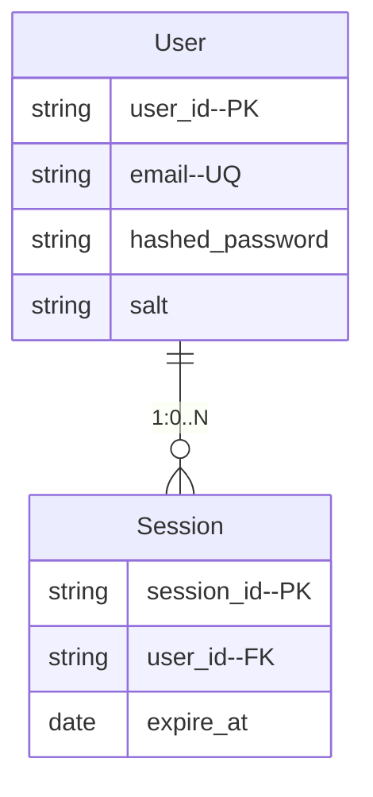
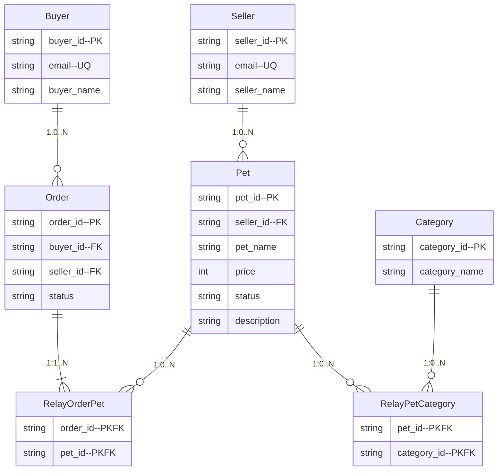

# ER図

注意点
- 各Entityに対しての created_at, updated_at, is_deleted は省略する
- PKやFK,UQの通常の書き方だとmermaidのプレビュー表示が崩れるので`field--PK`みたいな書き方にしている.

## Auth

RDBMS(mysql)を想定

## Core

補足

[各オブジェクトの状態](/docs/usecase.md#各オブジェクトの状態)

### ER図

### コマンドモデル

ドキュメント指向DB(mongodb)を想定.

- 販売者, 購入者に関しては単なるCRUDを想定.また, authとの同期処理が必要なので, イベントソーシングではなくドキュメントを直更新する.
- ペット情報, 注文(とカート)に関してはイベントソーシングの想定.イベントとスナップショットを保存する.

NOTE: 集約をそのまま保存するのはスナップショットを保存することと同じことになるが, 実装がかなり楽なってしまうので今回はしない.イベントの取得N回毎にスナップショットを作成する

### クエリモデル

一旦コマンドモデルで利用するmongodbのslaveを想定.

TODO: mysqlで最新状態を表す読み込み用のDBを作る.履歴関連はコマンドモデルで利用しているDBのslaveを使う.計算済みの結果の格納や非正規化しても良さそうではある.ほぼER図と同様のテーブル構成になりそう.
