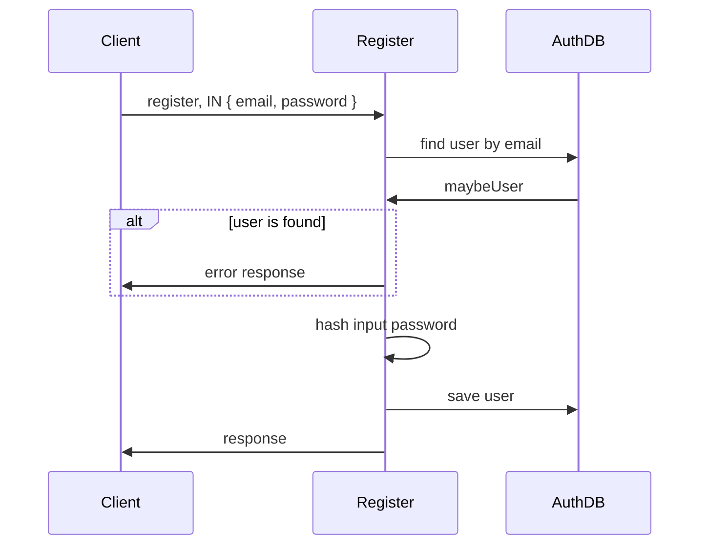
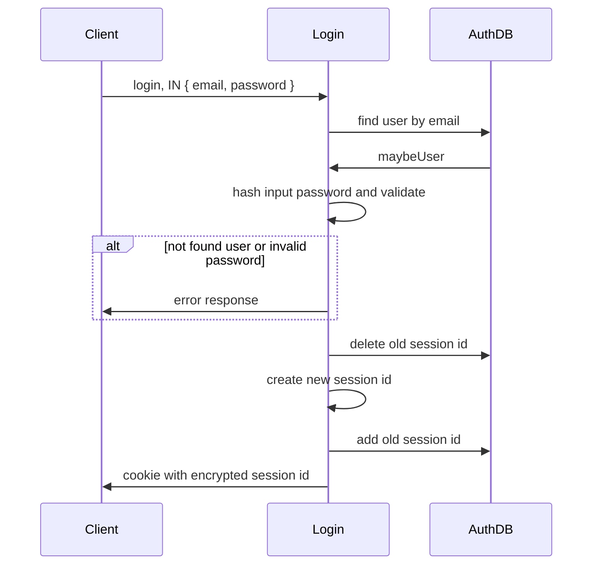
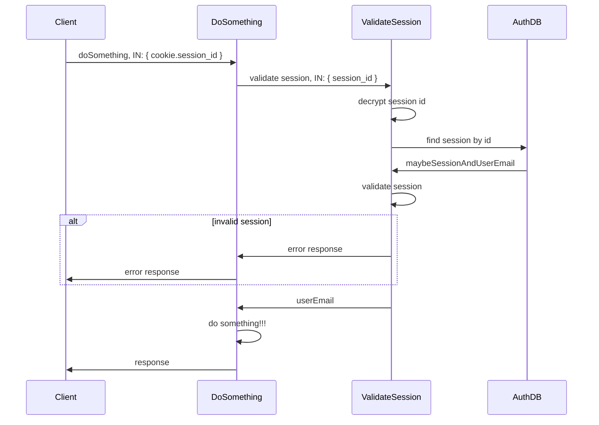
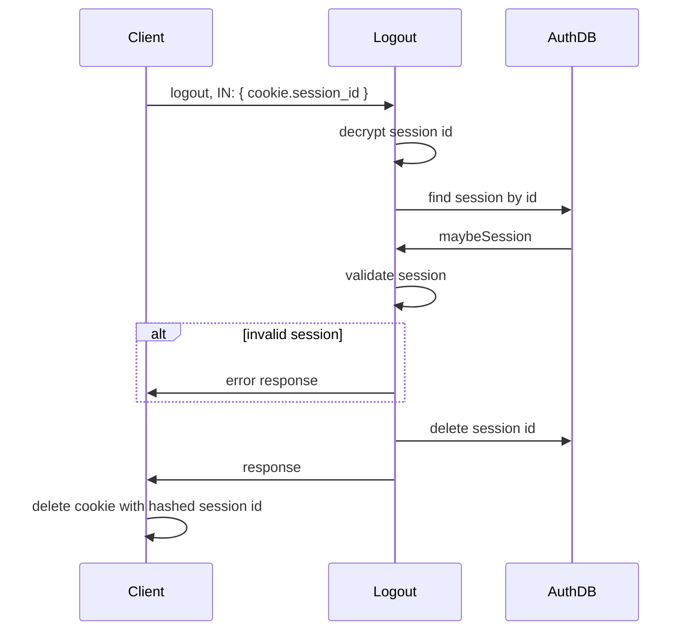

# シーケンス図(認証周りのユースケース)

簡略化のため最低限の正常系を書いている。

## 登録

- Client: Coreの販売者や購入者を登録するユースケース等のクライアント
- Register: Authのユースケース
- AuthDB: 認証情報を保持したDB

## ログイン

- Client: フロントエンド
- Login: Authのユースケース
- AuthDB: 認証情報を保持したDB

## 認証が必要なユースケース

- Client: フロントエンド
- DoSomething: Coreのユースケース
- ValidateSession: Authのユースケース
- AuthDB: 認証情報を保持したDB

## ログアウト

- Client: フロントエンド
- Logout: Authのユースケース
- AuthDB: 認証情報を保持したDB

